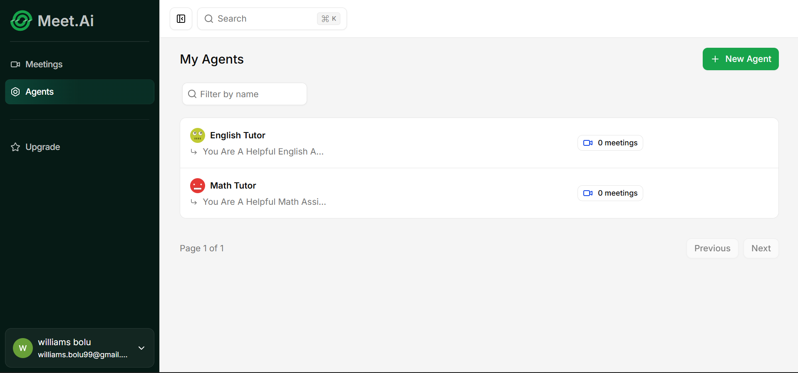

# Meet AI



An AI-powered video meeting platform built with Next.js 15, Stream Video, and OpenAI Realtime API. Connect with custom-trained AI agents that participate in your video calls, provide real-time voice responses, and generate detailed meeting summaries.

## 🚀 Overview

Meet AI allows users to create personalized AI agents with specific instructions. These agents can join video meetings, interact via voice in real-time using OpenAI's Realtime API, and provide post-meeting transcripts and AI-generated summaries. The platform features a comprehensive dashboard for managing agents, meetings, and premium subscriptions.

## 🛠️ Tech Stack

- **Framework**: [Next.js 15](https://nextjs.org/) (App Router)
- **Language**: [TypeScript](https://www.typescriptlang.org/)
- **Styling**: [Tailwind CSS v4](https://tailwindcss.com/), [Radix UI](https://www.radix-ui.com/), [Shadcn UI](https://ui.shadcn.com/)
- **Database**: [PostgreSQL](https://www.postgresql.org/) (via [Neon](https://neon.tech/)) with [Drizzle ORM](https://orm.drizzle.team/)
- **Authentication**: [Better Auth](https://www.better-auth.com/) (GitHub, Google, Email/Password)
- **Real-time Video/Chat**: [Stream Video & Chat SDKs](https://getstream.io/)
- **AI Integration**: [OpenAI GPT-4o](https://openai.com/) & [Realtime API](https://openai.com/index/introducing-the-realtime-api/)
- **Background Jobs**: [Inngest](https://www.inngest.com/) (Transcript processing & summarization)
- **Payments/Billing**: [Polar.sh](https://polar.sh/)
- **API Layer**: [tRPC](https://trpc.io/) for end-to-end type safety

## 📋 Requirements

- [Node.js](https://nodejs.org/) (v20 or higher)
- [npm](https://www.npmjs.com/) or [yarn](https://yarnpkg.com/)
- [PostgreSQL](https://www.postgresql.org/) database (Neon recommended)
- [Stream](https://getstream.io/) account for Video/Chat API keys
- [OpenAI](https://openai.com/) API key (with Realtime API access)
- [Polar.sh](https://polar.sh/) account for payments
- [Inngest](https://www.inngest.com/) account for background jobs
- [ngrok](https://ngrok.com/) for local webhook testing

## ⚙️ Setup

1.  **Clone the repository**:
    ```bash
    git clone https://github.com/your-username/meet-ai.git
    cd meet-ai
    ```

2.  **Install dependencies**:
    ```bash
    npm install
    ```

3.  **Environment Variables**:
    Create a `.env` file in the root directory and add the following:
    ```env
    # Database
    DATABASE_URL=postgresql://...

    # Better Auth
    BETTER_AUTH_SECRET=your_auth_secret
    BETTER_AUTH_URL=http://localhost:3000

    # OAuth
    GITHUB_CLIENT_ID=...
    GITHUB_CLIENT_SECRET=...
    GOOGLE_CLIENT_ID=...
    GOOGLE_CLIENT_SECRET=...

    # Stream SDK
    NEXT_PUBLIC_STREAM_VIDEO_API_KEY=...
    STREAM_VIDEO_SECRET_KEY=...
    NEXT_PUBLIC_STREAM_CHAT_API_KEY=...
    STREAM_CHAT_SECRET_KEY=...

    # AI
    OPENAI_API_KEY=...

    # Billing
    POLAR_ACCESS_TOKEN=...
    NEXT_PUBLIC_POLAR_ORGANIZATION_ID=... # TODO: Verify if needed

    # App
    NEXT_PUBLIC_APP_URL=http://localhost:3000
    ```

4.  **Database Migration**:
    ```bash
    npm run db:push
    ```

## 🚀 Running the App

### Development Server
```bash
npm run dev
```
Open [http://localhost:3000](http://localhost:3000) to see the application.

### Local Webhook Testing
To receive webhooks from Stream or Polar.sh locally, run:
```bash
npm run dev:webhook
```
*Note: You may need to update the ngrok URL in `package.json` to match your own.*

### Production Build
```bash
npm run build
npm start
```

## 📜 Scripts

| Script | Description |
| :--- | :--- |
| `npm run dev` | Starts the Next.js development server |
| `npm run build` | Builds the application for production |
| `npm start` | Starts the production server |
| `npm run lint` | Runs ESLint for code quality checks |
| `npm run db:push` | Pushes Drizzle schema changes to the database |
| `npm run db:studio` | Opens Drizzle Studio to manage database records |
| `npm run dev:webhook` | Runs ngrok for local webhook development |

## 📂 Project Structure

```
src/
├── app/                    # Next.js App Router (pages & API)
│   ├── (auth)/            # Authentication routes
│   ├── (dashboard)/       # Dashboard, Agents, Meetings, Upgrade
│   ├── call/              # Video call interface
│   └── api/               # API endpoints (tRPC, Inngest, Webhooks)
├── modules/               # Feature-based modular architecture
│   ├── agents/           # Agent management logic & UI
│   ├── auth/             # Auth-related components
│   ├── call/             # Meeting call logic & components
│   ├── meetings/         # Meeting list & details
│   ├── premium/          # Billing & Subscription logic
│   └── dashboard/        # Main dashboard UI
├── db/                   # Drizzle schema & database client
├── inngest/              # Background jobs & functions
├── lib/                  # Shared utilities & SDK clients
├── trpc/                 # tRPC router & procedures
├── hooks/                # Global React hooks
└── components/           # Shared UI components (Shadcn/UI)
```

## 🧪 Tests

Currently, the project uses linting for code quality. 
TODO: Add unit and integration tests.

## 📄 License

This project is licensed under the [MIT License](LICENSE) (TODO: Verify license).

---
*Developed with Next.js, Stream, and OpenAI.*
